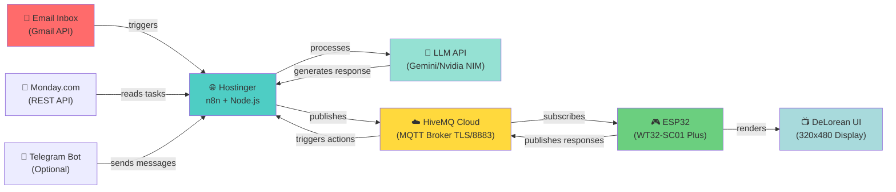

# LifeOS: Architecture & Technical Deep Dive

> **Circuitos do Tempo (Time Circuits)** — A fusion of 1980s DeLorean nostalgia with modern IoT/AI infrastructure.

---

## 🏗️ System Architecture Overview

### High-Level Message Flow



---

## 🔄 Component Architecture (Detailed)

### **Layer 1: External Data Sources**
```
┌─────────────────────────────────────────────────────┐
│           EXTERNAL INTEGRATIONS                     │
├─────────────────────────────────────────────────────┤
│                                                     │
│  📧 Gmail API              💼 Monday.com API       │
│  ├─ OAuth2 Authentication  ├─ Task Reading        │
│  ├─ IMAP Message Parsing   ├─ Board Updates       │
│  └─ Label Filtering        └─ Status Sync         │
│                                                     │
│  💬 Telegram Bot (Optional)                        │
│  ├─ Message Webhooks                              │
│  ├─ Command Processing                            │
│  └─ User Interactions                              │
│                                                     │
└─────────────────────────────────────────────────────┘
```

**Technical Details:**
- **Email Protocol:** IMAP with TLS encryption (port 993)
- **OAuth2 Flow:** Refresh tokens stored securely in Hostinger environment
- **Message Parsing:** Full text extraction + attachment metadata
- **Monday.com:** REST API v2 with GraphQL option for complex queries
- **Telegram:** Webhook mode (no polling required)

---

## WiFi Dual-Network Failover State Machine

The device automatically switches between primary and secondary WiFi networks:

```
┌──────────────────────────┐
│  Boot: Try Primary       │
│  (15 sec timeout)        │
└────┬─────────────────────┘
     │
     ├─ SUCCESS ──────────┐
     │                    │
     └─ FAIL              ▼
        (try 15s)    ┌──────────────────┐
        │            │ WIFI_PRIMARY     │
        │            │ (actively use)   │
        │            │ (check every 30s)│
        │            └──────────────────┘
        │                    │
        └────────┬───────────┤ Primary unavailable
                 │           │
                 ▼           ▼
        ┌──────────────────────────┐
        │ Try Secondary            │
        │ (15 sec timeout)         │
        └────┬─────────────────────┘
             │
             ├─ SUCCESS ────────────┐
             │                      │
             └─ FAIL                ▼
                (try 15s)      ┌──────────────────┐
                │              │ WIFI_SECONDARY   │
                │              │ (in use)         │
                │              │ (check primary   │
                │              │  every 30 sec)   │
                │              └────┬─────────────┘
                │                   │
                │      Primary      │
                │      returns      │
                │                   ▼
                │          ┌──────────────────────┐
                │          │ Switch to Primary    │
                │          │ (re-auth, reconnect) │
                │          └──────┬───────────────┘
                │                 │
                │                 ▼
                │        ┌──────────────────┐
                │        │ WIFI_PRIMARY     │
                │        │ (back to default)│
                │        └──────────────────┘
                │
                └────► WIFI_DISCONNECTED
                       (retry both networks
                        every 3 seconds)
```

---

## Screen State Machine

The device cycles between two exclusive screen states:

```
┌─────────────────┐
│    TERMINAL     │
│                 │
│  • MQTT inbox   │
│  • 20-line log  │
│  • Action        │
│    selector     │
│  • SEND button  │
│                 │
│ (Touch label)   ├────────────┐
└─────────────────┘            │
                        Transition
                        Animation
                        (DeLorean)
                               │
┌─────────────────┐            │
│  CLOCK (BTTF)   │◄───────────┘
│                 │
│  4 time rows:   │
│  • Destination  │
│  • Last Depart  │
│  • Sync Point   │
│  • Present (*)  │
│                 │
│  • Flux Capacitor
│    (animated)   │
│  • Control btns │
│                 │
│ (Touch flux or  ├────────────┐
│  envelope)      │            │
└─────────────────┘            │
                        Transition
                        Animation
                               │
                               └─────► Back to TERMINAL
```

**Transitions**:
- **Terminal → Clock**: Tap the "LLM TRANSMISSION" label at top → shows 540 ms pixel-art loading animation
- **Clock → Terminal**: Tap flux capacitor or envelope icon → same animation, returns to terminal
- **Automatic return**: None (user must explicitly trigger)

**Key invariant**: Only one screen is rendered at a time; switching initializes the target screen's state.

---

## MQTT Message Flow

### Subscriptions

```
┌──────────────────┐
│  MQTT Broker     │
│  (TLS port 8883) │
└────────┬─────────┘
         │
         ├──► home/llm/inbound  (QoS 1)
         │    [Source: LLM, n8n, or external system]
         │
         └──► home/llm/command   (QoS 1, reserved)
              [Source: Future use]
```

**On inbound message** (`home/llm/inbound`):
1. Receive JSON or plain text payload
2. Parse JSON fields (try: `source`, `message`; fallback on `from`, `text`, etc.)
3. Deduplicate: ignore if same topic + source + message within 1.5 seconds
4. Format and append to terminal history: `> SOURCE: MESSAGE`
5. Cache last source and preview (first 80 chars) for status publication
6. Render to screen if terminal is active

### Publications

```
┌──────────────────┐
│  MQTT Broker     │
│  (TLS port 8883) │
└────────┬─────────┘
         │
         ├──► home/llm/response  (QoS 0, non-retained)
         │    [Source: esp32_touch, ts_ms, action]
         │
         └──► home/llm/status    (QoS ?, RETAINED)
              [Device health, screen, uptime, last action]
```

**On user action** (SEND button):
1. Serialize selected action: `{"action": "YES", "source": "esp32_touch", "device": "DESKTOP-BUDDY-BTTF", "ts_ms": 12345}`
2. Publish to `home/llm/response` (QoS 0, not retained)
3. Immediately trigger status update
4. Append feedback to terminal: `> ESP: Payload sent: YES (OK)`

**On heartbeat** (every 45 seconds, or after action):
1. Serialize device state: device ID, screen, WiFi/MQTT health, uptime, last action, last source, last preview
2. Publish to `home/llm/status` **retained** (important: enables stateful subscribers to recover on boot)
3. Update `lastHeartbeatAt` timestamp

### JSON Payload Examples

**Inbound** (what the device expects):
```json
{
  "source": "n8n",
  "message": "Deploy to production?",
  "timestamp": 1234567890
}
```
Alternative fields: `from`, `agent`, `text`, `prompt`, `question`

**Response** (what the device publishes):
```json
{
  "action": "YES",
  "source": "esp32_touch",
  "device": "DESKTOP-BUDDY-BTTF",
  "ts_ms": 45821933
}
```

**Status** (retained, published every 45 sec):
```json
{
  "device": "DESKTOP-BUDDY-BTTF",
  "project": "Desktop Buddy BTTF",
  "screen": "terminal",
  "wifi": true,
  "mqtt": true,
  "last_action": "YES",
  "selected_action": "YES",
  "last_source": "n8n",
  "last_preview": "Deploy to production?",
  "uptime_s": 3600
}
```

---

## Component Architecture

### Hardware Abstraction Layer (LovyanGFX)

```
ESP32-S3 GPIO Pins
     │
     ├─ 8-bit parallel bus (D0–D7) ──────┐
     │                                    │
     ├─ Control pins (WR, RD, RS) ───────┤──► ST7796 LCD Panel (320×480)
     │                                    │
     └─ Backlight PWM ──────────────────┘

I2C Bus (SDA=GPIO6, SCL=GPIO5)
     │
     └──► FT5x06 Touch Controller
```

**Display driver** (`LGFX class`): Parallel 8-bit interface @ 40 MHz → ST7796 panel. Rotation=0 (portrait). Brightness via PWM on GPIO 45.

**Touch controller**: FT5x06 @ 400 kHz I2C → capacitive sensor calibrated for 320×480 viewport. Debounced in software (180 ms threshold).

---

### Rendering Pipeline

```
┌────────────────────────┐
│  Main Event Loop       │
│  (loop() in .ino)      │
└────────┬───────────────┘
         │
         ├─► maintainConnections()
         │   ├─ connectWiFi() [if needed]
         │   ├─ attemptMqttConnect() [if needed]
         │   └─ mqttClient.loop() [process callbacks]
         │
         ├─► handleTouch()
         │   ├─ [STATE_TERMINAL] → selector, send, screen switch
         │   └─ [STATE_CLOCK] → rocker buttons, tag presses
         │
         ├─► drawStatusBar() [terminal only, every 300 ms if changed]
         │
         └─► [STATE_CLOCK] clockPanel.update()
             ├─ updatePresentTimeIfNeeded() [sync to NTP second]
             └─ animateFluxIfNeeded() [48 ms frame, ~21 Hz]
```

**Rendering strategy**:
- **Terminal screen**: Full redraw on state change, incremental status bar updates
- **Clock screen**: Static layout (drawn once on `begin()`), only animate flux capacitor and update PRESENT TIME row
- **Color palette**: 20 pre-computed RGB565 colors initialized at startup
- **Double-buffering**: Not used (display supports partial updates efficiently)

---

### Data Flow: Message Reception

```
Broker Message
     │
     ▼
mqttCallback()  [PubSubClient callback]
     │
     ├─ Skip if topic is our own (status/response)
     ├─ Parse payload (JSON → fields or plain text)
     ├─ Extract source: try "source" → "from" → "agent" → guess from topic
     ├─ Extract message: try "message" → "text" → "prompt" → "question" → echo JSON
     ├─ Deduplicate: if same (topic + source + msg) within 1.5 sec, drop
     │
     ├─ Update: lastInboundSource, lastInboundPreview
     │
     └─ appendSystemLine(source, message)
         │
         ├─ pushWrapped() → wrap text at word boundaries, 40 chars/line
         ├─ pushTerminalLine() → add to 20-line ring buffer
         │
         └─ [if STATE_TERMINAL active] renderTerminalLines()
            ├─ Draw terminal box (black background)
            ├─ Iterate last N lines, render with color (source = yellow, message = green)
            └─ Draw cursor (_ blinking indicator)
```

---

### Data Flow: User Action

```
User Touch
     │
     ▼
handleTouch()
     │
     ├─ [STATE_TERMINAL] handleTerminalTouch(x, y)
     │  │
     │  ├─ [hitRect(selectorBox)] → selectedActionIndex++
     │  │  └─ drawControlArea(true) [redraw selector and button]
     │  │
     │  ├─ [hitRect(btnSend)] → pressButton(btnSend)
     │  │  └─ publishSelectedAction()
     │  │     │
     │  │     ├─ Serialize JSON: action, source, device, ts_ms
     │  │     ├─ mqttClient.publish(TOPIC_TX_RESPONSE, ...)
     │  │     ├─ Append feedback to terminal
     │  │     └─ publishDeviceStatus() [immediate status update]
     │  │
     │  └─ [hitRect(terminalClockHotspot)]
     │     └─ currentScreen = STATE_CLOCK
     │        └─ drawLoadingDelorean(540) → clockPanel.begin()
     │
     └─ [STATE_CLOCK] handleClockTouch(x, y)
        │
        ├─ [hitRect(clockFluxHotspot | clockMsgIconHotspot)]
        │  └─ drawLoadingDelorean(540) → currentScreen = STATE_TERMINAL → drawTerminalScreen()
        │
        └─ [else] clockPanel.handleButtonsAndTags(x, y)
           └─ Rocker button toggles (_fluxEnabled, _panelLedsEnabled)
              └─ Redraw affected UI elements
```

---

## Key Design Decisions

### 1. **Retained Status Messages**
- **Why**: Stateful MQTT subscribers (dashboards, logging systems) can recover device state on boot without waiting for next heartbeat
- **Trade-off**: Broker stores extra data; worth it for operational visibility

### 2. **45-Second Heartbeat + On-Action Updates**
- **Why**: Balances freshness (action updates are immediate) with network traffic (45 sec baseline)
- **Implementation**: After action, immediately publish; normal loop checks `millis() - lastHeartbeatAt > 45000`

### 3. **Deduplication in MQTT Callback**
- **Why**: Prevent display spam if broker re-delivers or network lag causes duplicates
- **Signature**: `topic + source + message` → ignore if same within 1.5 seconds
- **Trade-off**: May miss legitimate repeat messages; 1.5 sec window is conservative

### 4. **Insecure MQTT Fallback After 3 Failures**
- **Why**: Self-signed certificates are common in home/lab environments; graceful degradation on cert issues
- **Implementation**: After 3 connection failures, call `espClient.setInsecure()` to allow any certificate
- **Security caveat**: Only use in trusted networks; logs failure to Serial for debugging

### 5. **7-Segment Displays with "Ghost" Segments**
- **Why**: Retro authenticity (shows off-segments faintly) + clarity (dark segments visible even when off)
- **Rendering cost**: ~24 pixels per digit × 8 digits; negligible at 40 MHz display clock

### 6. **Single Flux Capacitor Animation**
- **Why**: Iconic visual; frame-throttled to 48 ms (~21 Hz) to save CPU vs. display refresh (typically 60 Hz)
- **State**: Independent `_fluxPhase` counter; animation continues even if terminals inactive (if STATE_CLOCK)

---

## Performance & Memory

| Metric | Value | Notes |
|--------|-------|-------|
| **Display Clock** | 40 MHz | Parallel 8-bit bus @ ST7796 |
| **Touch Debounce** | 180 ms | Software filter for accidental taps |
| **MQTT Buffer** | 1024 bytes | Max payload size |
| **Terminal History** | 20 lines | Ring buffer; ~40 chars/line avg. |
| **JSON Doc Size** | 384–512 bytes | StaticJsonDocument (no heap fragmentation) |
| **Flux Animation** | 48 ms frame | ~21 Hz, decoupled from display refresh |
| **Status Heartbeat** | Every 45 sec | Or immediately on user action |

**Memory**: ESP32-S3 has 8 MB PSRAM; firmware uses <2 MB with all libraries. No heap fragmentation risk (static JSON buffers).

---

## Network & Connectivity

### WiFi
- **Mode**: Station (connect to existing WiFi AP)
- **Startup**: Blocking `WiFi.begin()` with 45-second timeout → fallback if unsuccessful
- **Reconnection**: Auto-attempted every 3 seconds if disconnected
- **NTP Sync**: On boot, blocks up to 6 seconds (20 retries × 300 ms) to fetch time

### MQTT
- **Protocol**: MQTT 3.1.1 over TLS 1.2
- **Port**: 8883 (standard TLS port)
- **Auth**: Username + password
- **Certificate**: CA root cert in `secrets.h` for broker verification
- **Fallback**: On 3 consecutive connection failures, disable cert validation (`setInsecure()`)
- **Reconnection**: Attempt every 3 seconds; generates random client ID each attempt

### Security
- **TLS certificate pinning**: Not implemented; relies on CA bundle
- **Secrets**: WiFi SSID/password, MQTT host/user/password, CA cert stored in `secrets.h` (Git-ignored)
- **No hardcoded defaults**: Failure to configure `secrets.h` → empty credentials → MQTT fails gracefully

---

## Testing & Debugging

### Serial Monitor
```
Serial.begin(115200)  →  messages:
  - WiFi connect/status
  - MQTT connection attempts and failures
  - [No payload logging to avoid spam]
```

### MQTT Topic Monitoring
Use external tool (e.g., `mosquitto_sub`) to monitor topics:
```bash
mosquitto_sub -h broker.example.com -p 8883 --cafile ca.crt \
  -u user -P pass -t 'home/llm/#' -v
```

### Simulation
Publish test message:
```bash
mosquitto_pub -h broker.example.com -p 8883 --cafile ca.crt \
  -u user -P pass -t home/llm/inbound \
  -m '{"source":"test","message":"Hello!"}'
```

---

## Future Enhancements

- **LED output**: GPIO pins for external LED control (complement the "rocker button" display)
- **IR receiver**: Remote control compatibility
- **Variant clock modes**: Different themes or time formats
- **Over-the-air (OTA) updates**: Would require HTTPS server or MQTT-based firmware push
- **Local web interface**: Minimal HTTP server for status/config (requires ~15 KB extra)

---

## Summary

Desktop Buddy BTTF is a **minimal but professional embedded messaging interface**: single-screen real-time messaging with styled alternate UI and hardware integration. The architecture prioritizes **responsiveness** (immediate visual feedback), **reliability** (graceful network fallback), and **clarity** (readable code, clear MQTT contract). It demonstrates solid embedded systems fundamentals suitable for IoT, home automation, or lab monitoring applications.
